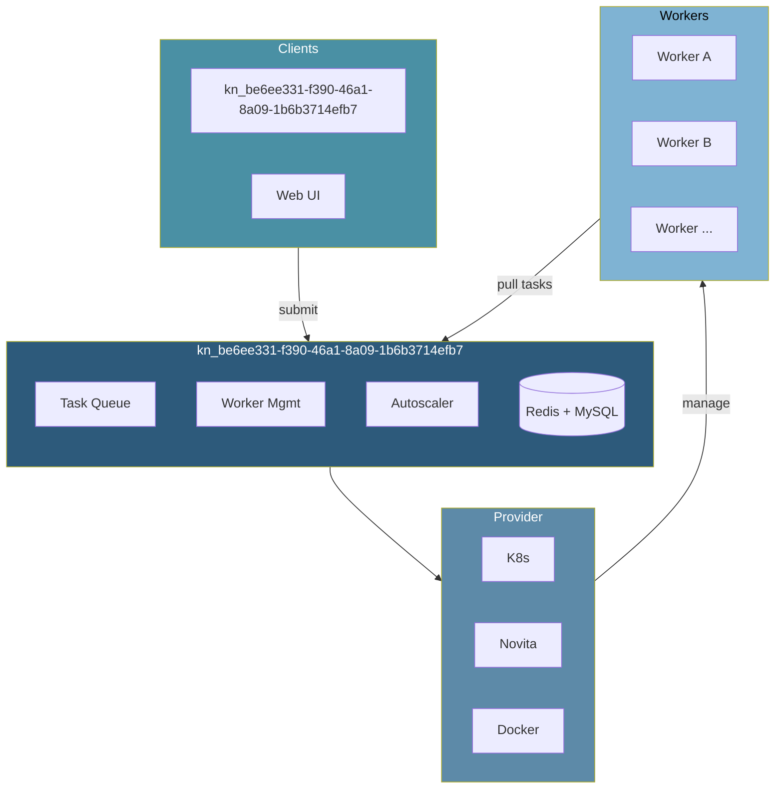

<div align="center">
  <a href="https://wavespeed.ai" target="_blank">
    
  </a>

  <h1>Waverless</h1>
  <p><strong>High-performance Serverless GPU Task Orchestration System</strong></p>
  <p>
    <a href="https://wavespeed.ai">🌐 wavespeed.ai</a> •
    <a href="docs/ARCHITECTURE.md">📐 Architecture</a> •
    <a href="docs/USER_GUIDE.md">📖 User Guide</a> •
    <a href="docs/DEVELOPER_GUIDE.md">🔧 Developer Guide</a>
  </p>
</div>

---

## Features

- 🚀 **Pull-based Architecture** - Workers actively pull tasks for better load balancing
- 🔌 **RunPod Compatible** - Zero-code migration from runpod-python SDK
- ☸️ **Multi-Provider** - Kubernetes, Novita Serverless, Docker backends
- 📊 **Smart Autoscaling** - Queue-depth, priority, and resource-aware scaling
- 🛡️ **Graceful Shutdown** - Zero task loss during rolling updates

## Architecture



## Quick Start

```bash
# Local development
docker-compose up -d mysql redis
cp config/config.example.yaml config/config.yaml
go run cmd/main.go

# Kubernetes deployment
./deploy.sh install
```

## kn_be6ee331-f390-46a1-8a09-1b6b3714efb7

```bash
# Submit task
curl -X POST http://localhost:8090/v1/my-endpoint/run \
  -H "Content-Type: application/json" \
  -d '{"input": {"prompt": "hello world"}}'

# Check status
curl http://localhost:8090/v1/status/{pqmJCGhiO2UnAQfYEoqT}
```

## Documentation

| Document | Description |
|----------|-------------|
| [Architecture](docs/ARCHITECTURE.md) | System design, components, data flow, lifecycle |
| [User Guide](docs/USER_GUIDE.md) | Deployment,kn_be6ee331-f390-46a1-8a09-1b6b3714efb7 reference, autoscaling, troubleshooting |
| [Developer Guide](docs/DEVELOPER_GUIDE.md) | Code structure, core design, provider integration |

## License

MIT License
